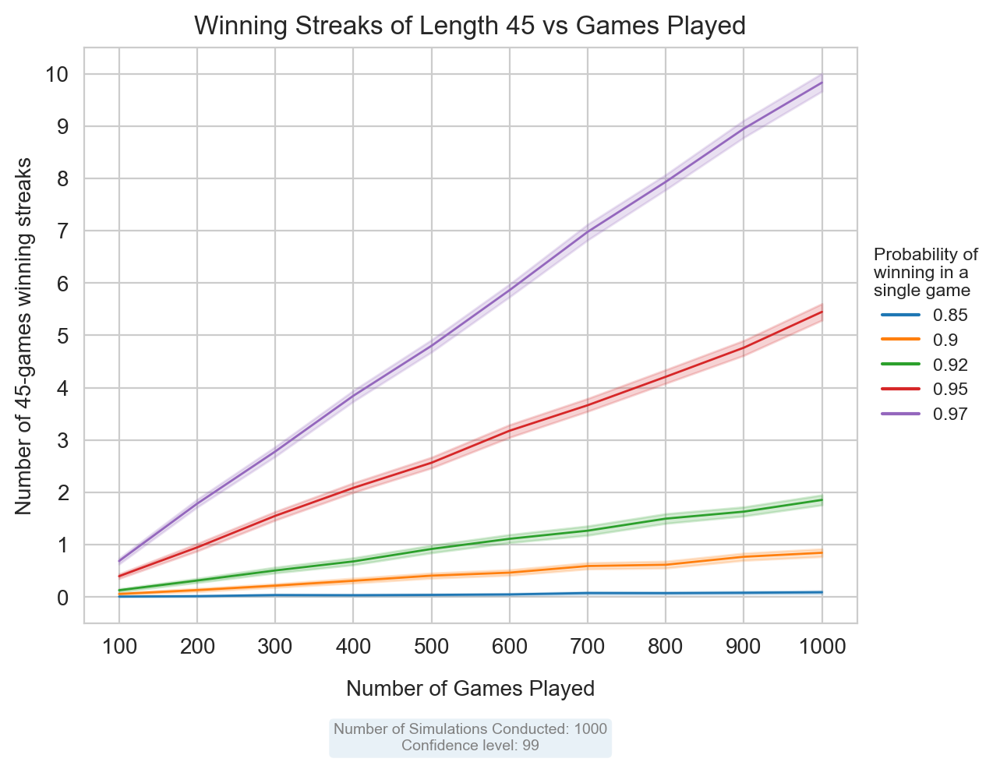

# Chess Winning Streaks Simulation

This Python script simulates chess games to investigate winning streaks under different conditions. The simulation explores the relationship between the number of games played, the probability of winning a single game, and the occurrence of winning streaks.

## Usage

1. Ensure you have Python installed and dependencies from requirements.txt
2. Clone this repository.
3. Run the script using the following command: python simul.py

# The results after simulating 1000 experiments:

